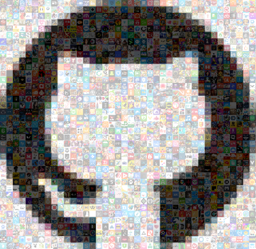
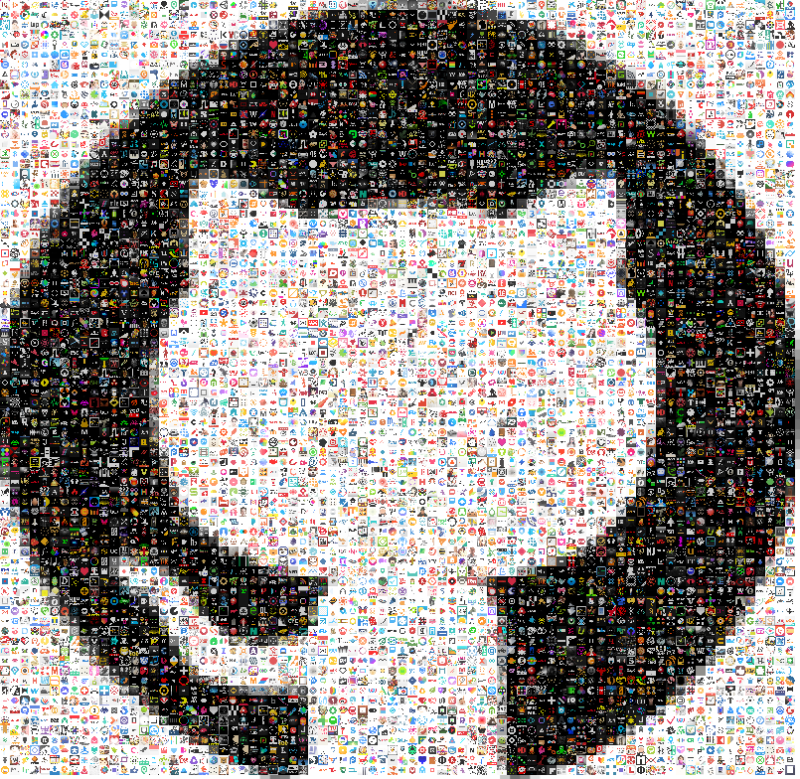

# Icon Pixel 'Art' with Python + OpenCV

Convert Images into pixel 'art' where the pixels can be composed of provided icon images.

### Example Input/Output:

* _standard pixelation created with `pixel_art.pixelate`_
* _icon pixelation created with `pixel_art.pixel_icon_recolor` & `pixel_art.pixel_icon_match`_
  
<p align='center'>
 <kbd>
  
 </kbd>
</p>

### Usage

#### Pixelate an image

The user has control over the pixelation effect by setting the `ncol` parameter, which controls how many 'pixels' wide the output will have.  This parameter controls the number of pixel blocks, not the actual width of the image (which can be set by `out_width`).

This process also returns the final dimensions of the pixel grid created.

```python
import pixel_art
import cv2

image = cv2.imread('images/github_logo.png')

# create pixelated version of input image
pixelated_image, (nrow, ncol) = pixel_art.pixelate(image, ncol=40, out_width=500)
```

<p align='center'>
 
</p>

#### Pixelate an image with icons

##### With recolor

This process creates a grid of icons that are sized appropiately to match the pixelation size chosen by the user.  Icons are laid out randomly by `random.choice` (sampled with replacement).  The resulting icon grid is then recolored by overlaying a transparent pixelated version of the input image.  The alpha level of the overlay can be set with the `recolor_alpha` parameter.

```python
import cv2
from imutils.paths import list_images
import pixel_art

image = cv2.imread('images/github_logo.png')
icon_paths = list(list_images('path/to/icons/dir'))

# create pixelated version of input image from 'icons'
# where the icons are recolored to match the pixelated input image
recolor_icon_image = pixel_art.pixel_icon_recolor(image,
                                                  icon_paths=icon_paths,
                                                  ncol=40,
                                                  out_width=500)
```

<p align='center'>
 
</p>

##### With color matching icons

This process chooses icon location based on the color matching to the input image.  This process takes more processing than the other icon pixelation process.  The user provides a tolerance level for the color matching, if no icons are matched within the tolerance then a random icon is chosen and recolored to match.  If multiple icons are found within the tolerance then one is selected at random by `random.choice`.

```python
import cv2
from imutils.paths import list_images
import pixel_art

image = cv2.imread('images/github_logo.png')
icon_paths = list(list_images('path/to/icons/dir'))

# extract dominant colors from icons for color
# matching process in pixel_art.pixel_icon_match
icon_stats = pixel_art.get_icon_colors(icon_paths)

# create pixelated version of input image from 'icons'
# where the icons are attempted to be matched to the 
# color of the pixelated input image
match_icon_image = pixel_art.pixel_icon_match(image,
                                              icon_stats,
                                              ncol=40,
                                              out_width=500)
```

<p align='center'>
 
</p>
